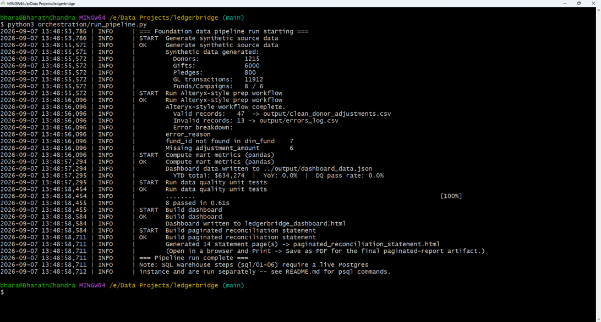
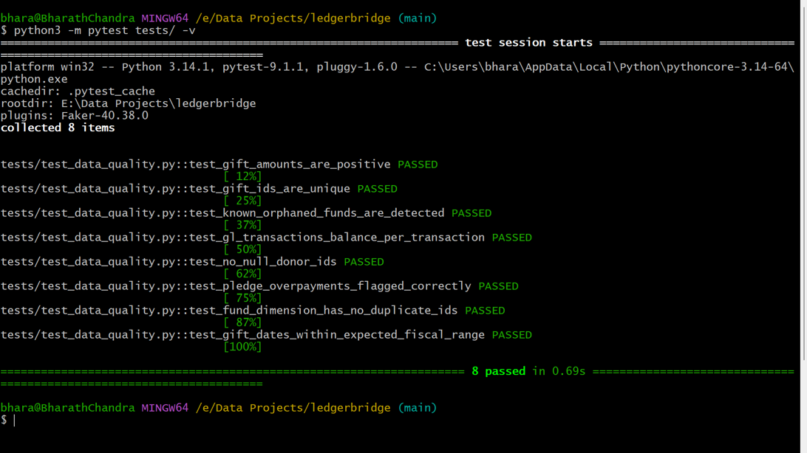
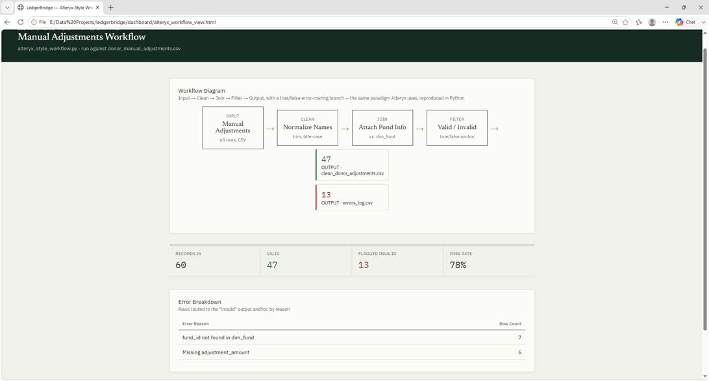

# LedgerBridge

**Reconciliation and retention analytics for a university-foundation-style fundraising and accounting environment.**

Fundraising CRMs and accounting ERPs are separate systems. Gift revenue
reported by Advancement almost never matches revenue posted to the General
Ledger on day one — timing lags, unposted batches, and fund miscoding all
cause drift, and it gets worse during an ERP transition. LedgerBridge
ingests both sides, reconciles them automatically, tracks donor retention
health, and grades its own data quality on every run.

Built as a hands-on demonstration of the full data engineering + BI stack
used by advancement/accounting teams: ELT pipelines, dimensional modeling,
stored procedures, automated data quality, Alteryx-style data prep, and
Power BI / SSRS-style reporting.

## Quick start

```bash
pip install -r requirements.txt
python3 orchestration/run_pipeline.py
```

This generates synthetic source data, runs the Alteryx-style prep workflow,
computes warehouse metrics, runs the pytest data quality suite, and builds
both the interactive dashboard and the paginated reconciliation statement.
Open `dashboard/ledgerbridge_dashboard.html` in a browser when it's done.

The SQL warehouse (`sql/01`–`06`) is written for Postgres and requires a
live instance — see "Running against a real database" below.


## Screenshots

**Pipeline running end to end** — synthetic data generation, Alteryx-style workflow, data quality tests, dashboard build, all in one run:



**Data quality test suite passing** (`pytest tests/ -v`):



**Alteryx-style workflow** — Input → Clean → Join → Filter → Output, with a true/false error-routing branch:



## What's in here

```
ledgerbridge/
├── data_generation/
│   ├── generate_synthetic_data.py     # Salesforce-style + NetSuite-style source data, w/ 6 intentional data issues
│   └── build_dashboard_data.py        # Recomputes mart-equivalent metrics in pandas -> dashboard_data.json
├── salesforce_integration/
│   ├── pull_salesforce_data.py        # REAL Salesforce API extraction via SOQL (simple-salesforce)
│   ├── SETUP.md                       # How to stand up a free Salesforce Developer Org for this
│   └── .env.example
├── sql/
│   ├── 01_schema_and_raw.sql          # raw schema + load pattern
│   ├── 02_staging.sql                 # cleaning / deduping views
│   ├── 03_mart_dimensional_model.sql  # star schema, load procs, donor segmentation fn, reconciliation view
│   ├── 04_data_quality_checks.sql     # automated DQ engine -> mart.dq_results
│   ├── 05_sqlserver_variant.sql       # same logic in T-SQL (multi-database fluency)
│   └── 06_security_roles.sql          # role-based access (analyst_readonly vs data_engineer)
├── alteryx_style_workflow.py          # step-labeled ETL: Input -> Clean -> Join -> Filter -> Output
├── reporting/
│   └── generate_paginated_statement.py# SSRS-style paginated, print-exact Fund Reconciliation Statement
├── dashboard/
│   ├── build_html.py                  # generates the 4-page interactive dashboard
│   └── ledgerbridge_dashboard.html
├── orchestration/
│   └── run_pipeline.py                # scheduler entry point, logging, fail-fast on error
├── tests/
│   └── test_data_quality.py           # pytest suite, runs in CI
├── .github/workflows/ci.yml           # GitHub Actions: tests + SQL lint on every push
├── project_management/
│   └── backlog.csv                    # Jira-importable epic/story backlog
├── docs/
│   ├── data_dictionary.md
│   ├── erd.md                         # Mermaid ER diagram
│   ├── data_flow_diagram.txt
│   └── incident_log.md                # write-up of every bug found + how it was resolved
└── requirements.txt
```

## The centerpiece: fund reconciliation

`mart.fund_reconciliation` (and its pandas equivalent in
`build_dashboard_data.py`) compares gift revenue by fund/fiscal-month
against GL-posted revenue, and classifies each combination as:

- **Reconciled** — variance under $500
- **Timing Difference (OK)** — variance under 8% of gifts recorded (normal
  posting lag near month-end)
- **Needs Review** — a real discrepancy

This is deliberately *not* a naive "flag everything that doesn't match
exactly" rule — a good reconciliation tool understands the difference
between expected timing noise and an actual problem. See
`docs/incident_log.md` for the specific issues this caught in the synthetic
data (orphaned fund references, a missing GL batch, miscoded journal
entries, pledge overpayments, rounding errors).

## Running against a real database

```bash
createdb ledgerbridge
psql -d ledgerbridge -f sql/01_schema_and_raw.sql
# load raw/*.csv into raw.* tables, see the \copy examples at the bottom of 01_schema_and_raw.sql
psql -d ledgerbridge -f sql/02_staging.sql
psql -d ledgerbridge -f sql/03_mart_dimensional_model.sql
psql -d ledgerbridge -c "CALL mart.load_dim_date(); CALL mart.load_dims_and_facts();"
psql -d ledgerbridge -f sql/04_data_quality_checks.sql
psql -d ledgerbridge -c "CALL mart.run_data_quality_checks();"
psql -d ledgerbridge -f sql/06_security_roles.sql
```

Point Power BI Desktop (or any BI tool) at `mart.*` and `mart.dq_results`
directly — the views are shaped for exactly this.

## Honest scope notes

- **NetSuite / Alteryx**: no licenses used. GL data mirrors a real NetSuite
  saved-search export schema with proper double-entry posting; the Alteryx
  workflow is reproduced in Python with the same Input/Clean/Join/Filter/
  Output structure and a true/false-style error-routing branch. Both are
  called out explicitly wherever they're simulated.
- **Salesforce**: `salesforce_integration/pull_salesforce_data.py` is a real
  SOQL-based extractor, written to run against a free Salesforce Developer
  Edition org (see `SETUP.md`). The bulk of the demo data still comes from
  the synthetic generator so the project runs without external credentials.
- **Power BI**: delivered as a standalone HTML/Chart.js dashboard so it's
  viewable without a license; the underlying SQL views are written exactly
  as they'd be exposed to a real Power BI semantic model.
- **SSRS**: not licensed either; `reporting/generate_paginated_statement.py`
  produces the same kind of print-exact, parameterized output SSRS/Power BI
  Report Builder (both RDL-based) are used for.

## JD coverage map

| Requirement | Where |
|---|---|
| ETL/ELT pipelines, tables, views, stored procs, functions | `sql/01`–`03`, `orchestration/run_pipeline.py` |
| Troubleshoot pipeline failures / discrepancies / performance | `docs/incident_log.md`, DQ checks in `sql/04` |
| Power BI dashboards | `dashboard/` |
| Alteryx-style data prep | `alteryx_style_workflow.py` |
| SSRS / paginated reporting | `reporting/` |
| Salesforce | `salesforce_integration/` |
| Multi-database (SQL Server, Postgres, Oracle, Fabric) | `sql/05_sqlserver_variant.sql` |
| Data quality & governance | `sql/04`, `tests/`, `docs/incident_log.md` |
| Data security policy | `sql/06_security_roles.sql` |
| Dimensional data modeling | `docs/erd.md`, `sql/03` |
| Documentation | `docs/` |
| Version control / code review discipline | this repo's commit history, `.github/workflows/ci.yml` |
| Jira / coordinated work | `project_management/backlog.csv` |

## Status

v1.0 — pipeline runs end to end, 8/8 data quality tests passing, dashboard and paginated report both build cleanly.
