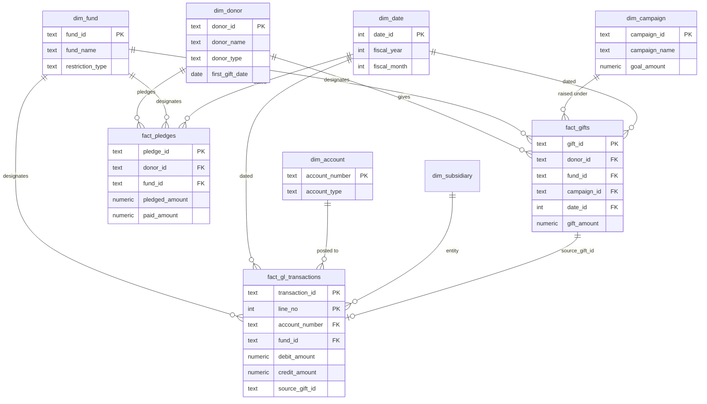

# Entity-Relationship Diagram — mart schema

```mermaid
erDiagram
    dim_donor ||--o{ fact_gifts : gives
    dim_donor ||--o{ fact_pledges : pledges
    dim_fund ||--o{ fact_gifts : designates
    dim_fund ||--o{ fact_pledges : designates
    dim_fund ||--o{ fact_gl_transactions : designates
    dim_campaign ||--o{ fact_gifts : "raised under"
    dim_date ||--o{ fact_gifts : "dated"
    dim_date ||--o{ fact_pledges : "dated"
    dim_date ||--o{ fact_gl_transactions : "dated"
    dim_account ||--o{ fact_gl_transactions : "posted to"
    dim_subsidiary ||--o{ fact_gl_transactions : "entity"
    fact_gifts ||--o| fact_gl_transactions : "source_gift_id"

    dim_donor {
        text donor_id PK
        text donor_name
        text donor_type
        date first_gift_date
    }
    dim_fund {
        text fund_id PK
        text fund_name
        text restriction_type
    }
    dim_campaign {
        text campaign_id PK
        text campaign_name
        numeric goal_amount
    }
    dim_account {
        text account_number PK
        text account_type
    }
    dim_date {
        int date_id PK
        int fiscal_year
        int fiscal_month
    }
    fact_gifts {
        text gift_id PK
        text donor_id FK
        text fund_id FK
        text campaign_id FK
        int date_id FK
        numeric gift_amount
    }
    fact_pledges {
        text pledge_id PK
        text donor_id FK
        text fund_id FK
        numeric pledged_amount
        numeric paid_amount
    }
    fact_gl_transactions {
        text transaction_id PK
        int line_no PK
        text account_number FK
        text fund_id FK
        numeric debit_amount
        numeric credit_amount
        text source_gift_id
    }
```

Render this at mermaid.live, or view directly if your Git host supports
inline Mermaid rendering (GitHub does).
